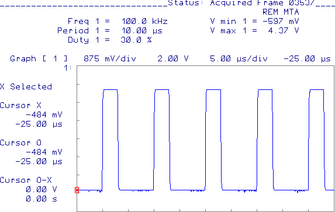
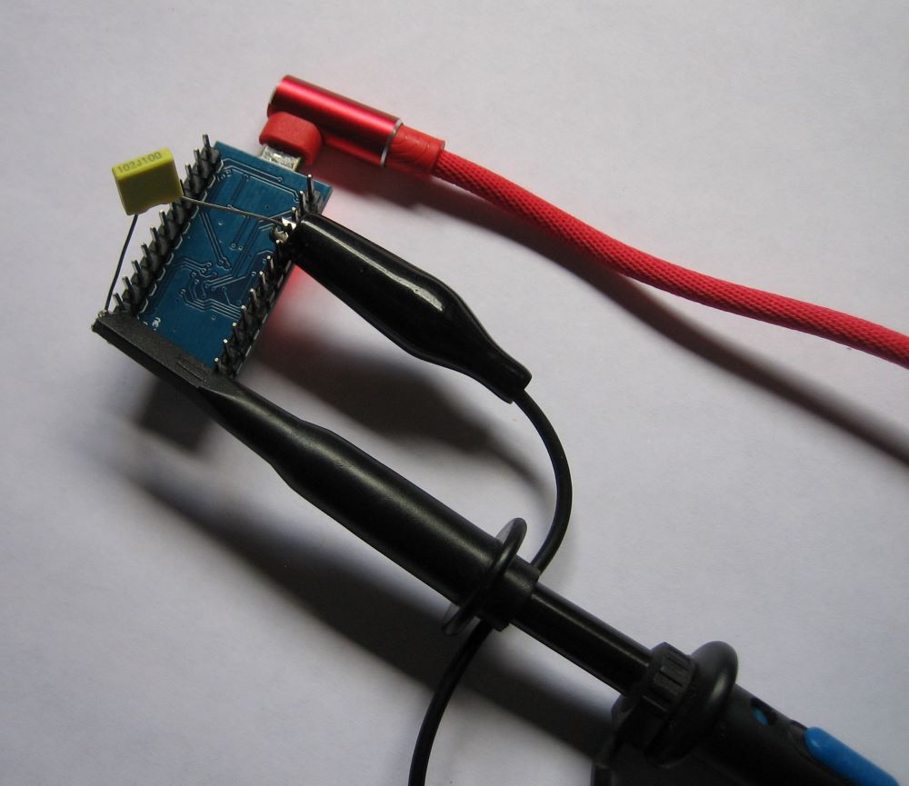

# TimerFour for ATMega16u4/ATMega32u4
> Allow usage of the 10-bit hardware high speed Timer4 on ATMega16u4 and ATMega32u4 based Arduino boards

## Description
This is a port of the Paul Stoffregens [TimerThree library](https://github.com/PaulStoffregen/TimerThree) to the ATMega16u4 or ATMega32u4, so you can use the internal High Speed Timer4 on selected ports. The ATMega32u4 is commonly found on an Arduino Micro, Leonardo, Yùn, Sparkfuns' (or generic) Pro Micro, Fio, ...

It has only been tested (yet) on a generic Pro Micro. For the Pro Micro you can use pin 5, 6, 9, 10, ~~12 or 13~~. However, note that half of the ports are complimentary ports, so you can't set the duty cycle seperately, see the table below:

| ATMega Pin |     16u4/32u4 Name      | Arduino Pin |     Note      |
|------------|-------------------------|-------------|---------------|
| PC7        | ICP3/CLK0/OC4A          |        \* 13 |               |
| PC6        | OC3A/#OC4A              |           5 | Inverse of 13 |
| PB6        | PCINT6/OC1B/OC4B/ADC13  |          10 |               |
| PB5        | PCINT5/OC1A/#OC4B/ADC12 |           9 | Inverse of 10 |
| PD7        | T0/OC4D/ADC10           |           6 |               |
| PD6        | T1/#OC4D/ADC9           |        \* 12 | Inverse of 6  |
*(\*) Not connected on the Pro Micro*

The minimum period for this library is 1 us (1 MHz) the maximum about 2 s (0.5 kHz).

## Usage
There is no need to instantiate the library, that has already been done when you include it. Define the period in setup:
```
void setup() {
	unsigned long period = 100; //100 us
    Timer4.initialize(period); 
}
```

Then you start the PWM with:
```	
char pin = 10;
unsigned int duty = 200; // Value between 3 and 1023
Timer4.pwm(pin, duty);
```
The duty cycle must vary between 3 and 1023; this maps to a value between approx. 0% and 100%.

## Example
See the examples directory. 

Below is a test of the SlowSawtooth on a generic Pro Micro. Basically it sweeps the duty cycle from 0 to 1023 on a fixed frequency. It is called 'SlowSawtooth', because with the right filter it could generate a sawtooth waveform.

The screengrab from my HP 54201D oscilloscope showing the waveform at 100kHz with 30% duty cycle (Timer4.pwm set to 308 and on pin 10 of the Pro Micro). I've attached a 1nF polyester film capacitor for noise suppression.




It has been tested up to **1Mhz** (period of 1us). 

## Thanks to
- Vincente Jiménez. His [post](http://r6500.blogspot.com/2014/12/fast-pwm-on-arduino-leonardo.html) clarifies a lot about the High Speed PWM
- Paul Stoffregen. For his great [TimerThree library](https://github.com/PaulStoffregen/TimerThree).

## License
"Creative Commons Attribution 3.0" license : http://creativecommons.org/licenses/by/3.0/